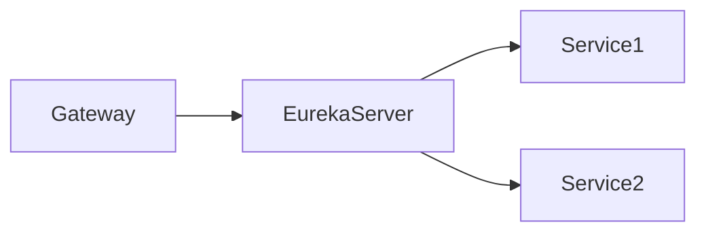

具体实现可参考代码 [Spring Cloud Gateway and Eureka (Github)](https://github.com/tzzs/gatewayEurekaDemo)

> 本文档中简单描述了如何使用 `Spring Cloud Gateway` 组件自动路由到 `Eureka` 注册中心上

以下为本次 Demo 中主要涉及的微服务模块：

1. 一个`Gateway`网关：实现前端路由的自动转发
1. 一个`Eureka`注册中心：实现多服务的注册
1. 两个接口提供模块：实现对应的接口功能，并通过`Eureka Client` 自动注册到 `Eureka Server`。



## Eureka Server 模块

此模块中仅提供单一的注册中心功能，配置如下：

```yaml
spring:
  application:
    name: eurekaserver
server:
  port: 9092

eureka:
  client:
    service-url:
      defaultZone: http://localhost:${server.port}/eureka/
    fetch-registry: false
    register-with-eureka: false
```

## Service 模块

在此微服务模块中，仅使用 `Spring Boot`与 `Eureka Client`实现对应接口的创建与注册。 ​

在两个 `Service`模块中分别提供一个接口，返回一个字符串 `This is service1.`与 `This is service2.`。
两个模块启动后可通过访问 `http://localhost:9093/`与 `http://localhost:9094/`测试是否正常启动。
​

```yaml
# application.yml  service1
server:
  port: 9093

eureka:
  client:
    service-url:
      defaultZone: http://localhost:9092/eureka
spring:
  application:
    name: service1
```

## Spring Cloud Gateway 模块

[参考文档](##参考文档)​

通过网关的路由功能，可以自动实现路由的转发功能，同时 `Spring Cloud Gateway`可以直接从 `Eureka Server`上获取注册模块，可以直接使用 `lb://${application_name}` （下面指定
uri 时会用到）完成对应多服务的转发。 ​

以下为`Spring Cloud Gateway`的部分配置： ​

`predicates`为路由的匹配配置： 即符合 `predicates` 下的条件才会路由到 `uri` 的地址。`Path`为路由匹配模式，路由前缀符合 `/api/service` 时才会满足条件（eg:
`http://localhost:9091/api/service2/get` ）. ​

`filters` 为路由的过滤器配置： 下面主要涉及两个配置， `PreFixPath`的配置的作用是，当请求路由满足 `predicates` 的条件时，路由转发时会在转发的路由前增加 `/add`路径，即请求路由为
`http://localhost:9091/api/service2` 转发路由为 `http://localhost:9094/add/api/service2`
。`RewritePath`的作用是满足条件时进行路由的重写，`/api/service2/?(?<segment>.*), /$\{segment}` 此正则的意思是把匹配路径中的 `/api/service2`去掉，即请求路由为
`http://localhost:9091/api/service2/` 时，转发路由为 `http://localhost:9094/` 。

```yaml
spring:
  application:
    name: gateway
  cloud:
    gateway:
      routes:
        - id: service
          uri: lb://SERVICE1
          predicates:
            - Path=/test/,/api/service1
          filters:
            - RewritePath=/api/service1/?(?<segment>.*), /$\{segment}

        - id: service2
          uri: http://localhost:9094
          predicates:
            - Path=/api/service2
          filters:
            #            - PrefixPath=/add
            - RewritePath=/api/service2/?(?<segment>.*), /$\{segment}
#      discovery:
#        locator:
#          enabled: true
server:
  port: 9091

eureka:
  client:
    service-url:
      defaultZone: http://localhost:9092/eureka/
```

## 参考文档

1. Spring Cloud Gateway 配置

   [https://docs.spring.io/spring-cloud-gateway/docs/current/reference/html/#gateway-request-predicates-factories](https://docs.spring.io/spring-cloud-gateway/docs/current/reference/html/#gateway-request-predicates-factories)

   [https://docs.spring.io/spring-cloud-gateway/docs/current/reference/html/#gatewayfilter-factories](https://docs.spring.io/spring-cloud-gateway/docs/current/reference/html/#gatewayfilter-factories)
